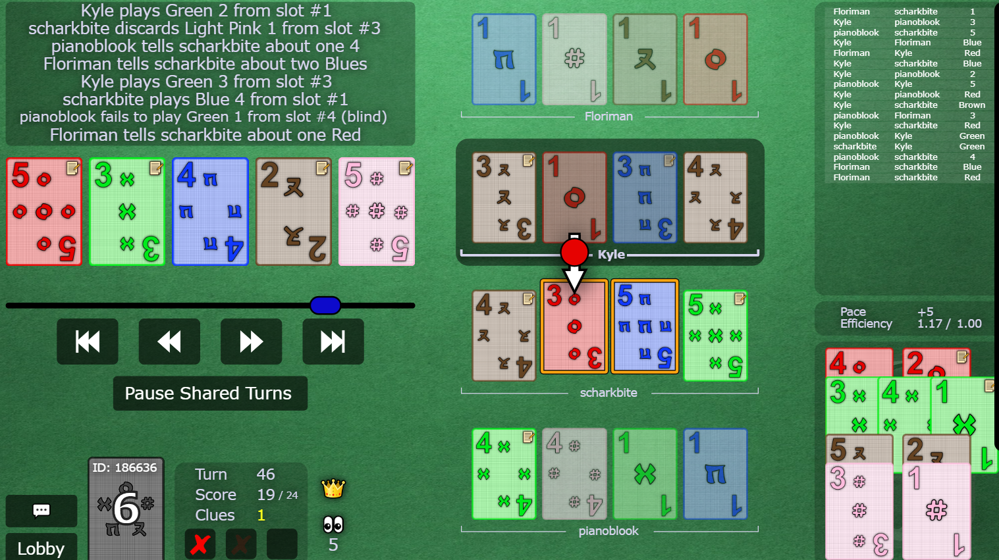
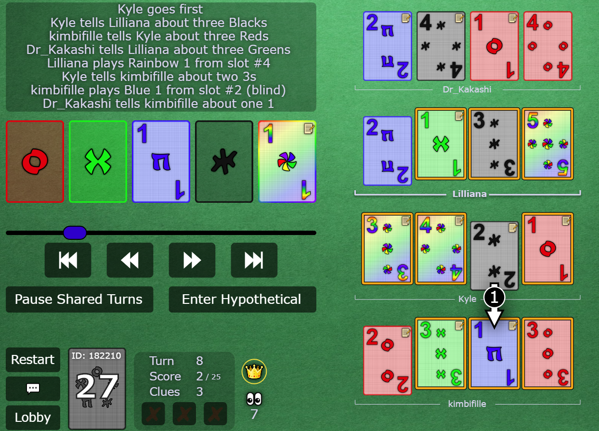
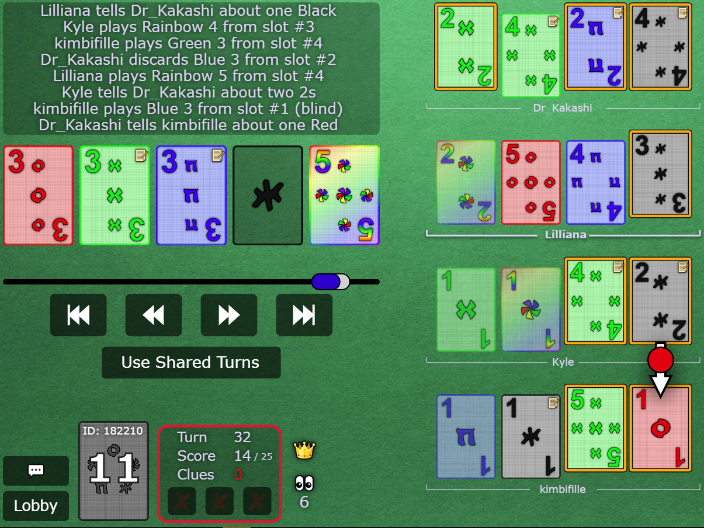

## Examples of the [Unnecessary Principles](../Reference.md#level-15---unnecessary-usage-of-complicated-moves)

### The Unnecessary Trash Push

* Normally, players are only allowed to perform a *Trash Push* if the card to "get" cannot be given a direct *Play Clue*. Subsequently, if the card **can** be clued directly, and a *Trash Push* is done anyway, this is very strange.
* In this situation, the very next player should blind-play their *Finesse Position* card as a *Known Bluff*. The receiver of the clue will interpret this as a *Trash Push Finesse* and will then play the pushed card. Once they play it, they will see that it does **not** match, and that an *Unnecessary Trash Push* occurred.
* For example, in a 3-player game:
  * All of the 2's are played on the stacks.
  * Alice clues number 1 to Cathy, touching a single 1 on her chop. Since all of the 1's are already played, it is globally known that this must be some kind of *Trash Push*.
  * Bob sees that the pushed card is a red 3. Cathy has no other red cards in her hand, so Alice could have just clued red to Cathy instead of doing a complicated *Trash Push*.
  * Thus, Bob knows that this is an *Unnecessary Trash Push*, and blind-plays his *Finesse Position* card. It is the blue 3 and it successfully plays.
  * Cathy knows that this must be a *Trash Push Finesse* on blue 4. Cathy blind-plays her slot 4 card, but it is red 3 instead and it successfully plays.
  * Cathy now knows that since the two cards did not match each other, this must have been an *Unnecessary Trash Push*.
* Often times, a (normal) *Trash Push* can provide a player with safe discards that stall out the discard of other useful cards in their hand. If this is the case, then the *Trash Push* would **not** be an *Unnecessary Trash Push*.

* derekcheah plays slot 1 as a *Trash Push*
* Animex52 notices that pianoblook could have clued r3 directly, and also plays slot 1 because of the *Unnecessary Trash Push*

### The Unnecessary Trash Push (Finesse Form)

* Normally, the *Unnecessary Trash Push* calls for the very next player to blind-play an unrelated card, similar to a *Bluff*.
* However, if the very next player can see that it could be a *Finesse*, then they should prefer that interpretation. This is similar to how the next player should always prefer a *Finesse* interpretation over a *Bluff* interpretation.
* For example, in a 4-player game:
  * All of the 2's are played on the stacks.
  * Alice clues number 1 to Cathy, touching a single 1 on her chop. Since all of the 1's are already played, it is globally known that this must be some kind of *Trash Push*.
  * Bob sees that the pushed card is a red 3. Cathy has no other red cards in her hand, so Alice could have just clued red to Cathy instead of doing a complicated *Trash Push*.
  * Thus, Bob knows that this is an *Unnecessary Trash Push*. Normally, Bob would immediately blind-play his *Finesse Position* card. However, Bob also sees that Donald has a red 4 in his *Finesse Position*. Since *Finesses* take precedence over *Bluffs*, Bob knows that he should let Donald be the one to blind-play from the "unnecessaryness".
  * Bob discards.
  * Cathy knows that this must be a *Trash Push*. Cathy blind-plays her slot 3 card. It is red 3 instead and it successfully plays.
  * Similar to Bob, Donald also sees that the *Trash Push* was unnecessary. Since Bob did not blind-play anything, this must be an *Unnecessary Trash Push Finesse*. Donald blind-plays his *Finesse Position* as red 4 and it successfully plays.

### Unnecessary Trash Push Finesse

Similar to what happens with ordinary *Trash Push*, if a *Trash Push Finesse* is performed even though a normal finesse is possible, an extra blind play is called for.

* Floriman clues r to scharkbite (green 5 was chop moved earlier), this card is known trash to all
* Kyle plays brown 3 as a *Trash Push Finesse*
* scharkbite plays brown 4 to complete the *Trash Push Finesse*
* pianoblook notices that Floriman could have clued brown 4 directly, which also would have let the same cards play. Therefore pianoblook also plays slot 1 as a *Unnecessary Trash Push Finesse*

### The Unnecessary Unknown Trash Discharge Chop Move (UUTDCM)

If an unnecessary *Unknown Trash Discharge* is performed, then the player who receives the clue should Chop Move in the same way as the *Unnecessary Trash Finesse Chop Move*.
Note again that this convention only applies if it touches exactly one trash card. (This is because we want players to have the ability to perform 2-for-1 UTDs without promising a Chop Move.)

### Unnecessary Trash Bluff Trash Push

If a *Trash Bluff* is done and the target card is on chop, there is nothing to chop move. In that case, the receiving player interprets this as a *Trash Push* from the card that is now known trash.

* Dr_Kakashi clues 1 to kimbifille, letting Lilliana play slot 1 as a *Trash Bluff*
* Kyle plays r1
* kimbifille notices that Lilliana's b2 could have been clued directly, and therefore also plays slot 1 as a *Trash Push*

### Unnecessary UTD Trash Push

* Dr_Kakashi clues red to kimbifille, letting Lilliana play b4 as an *Unknown Trash Discharge*
* Kyle sees that black 1 will play, and therefore does not need to play slot 1 as a cancellation blind play
* kimbifille sees that Dr_Kakashi could have easily clued b4 (using rank) and therefore blind plays slot 2 as a *Trash Push*
